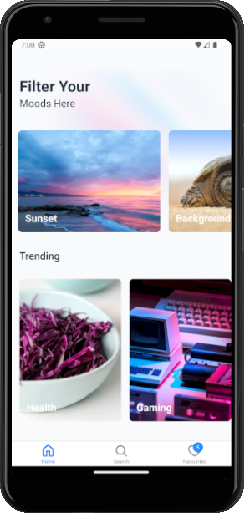
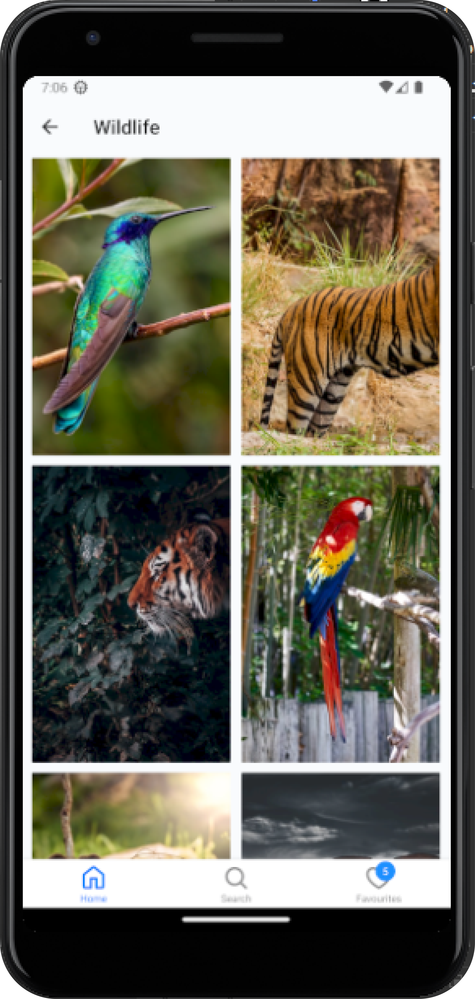
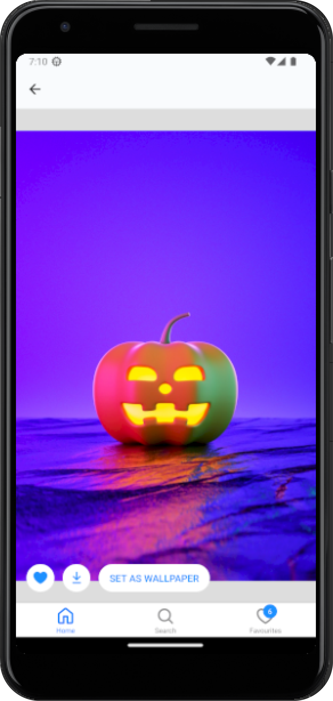
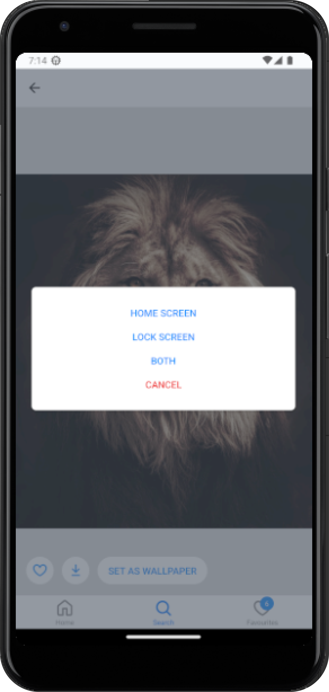
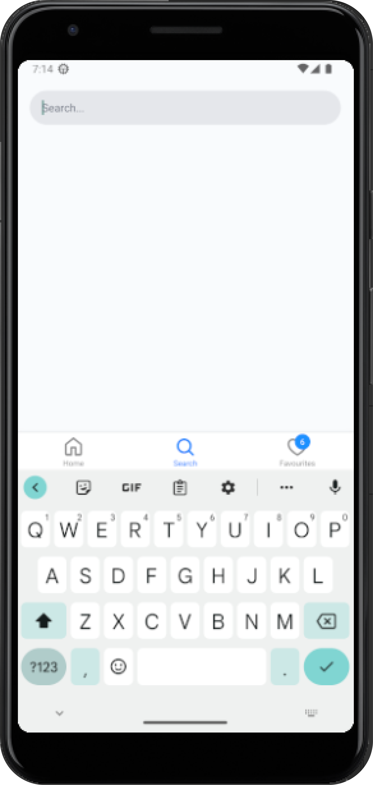
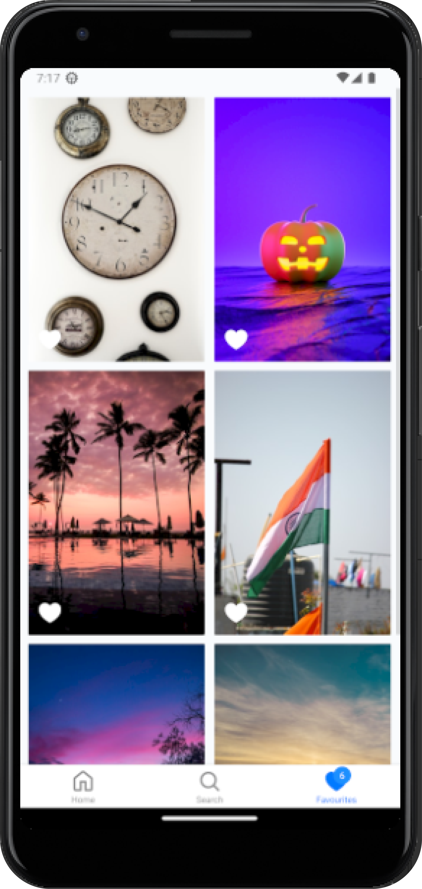

# Chromata
> Chromata is a React Native and Redux-based image viewer app that leverages the Unsplash API to fetch beautiful images and set them as wallpaper.

## About The App
- Begin with a selection of over 30 image categories.
- Enjoy unlimited scrolling within each category to discover endless images.
- View images in high resolution with options to download or favorite them, as well as the ability to set them as wallpaper.
- Explore the vast world of images through the app's search feature.
- Organize your favorite images with ease.

## Screenshots
<table>
    <tr>
        <td> </td>
        <td> </td>
        <td> </td>
    </tr>
</table>
<table>
    <tr>
        <td> </td>
        <td> </td>
        <td> </td>
    </tr>
</table>

## Dependencies
- [react-native-async-storage](https://www.npmjs.com/package/@react-native-async-storage/async-storage)
- [react-native-vector-icons](https://www.npmjs.com/package/react-native-vector-icons)
- [redux](https://redux.js.org/)
- [twrnc](https://www.npmjs.com/package/twrnc)
- [rn-fetch-blob](https://www.npmjs.com/package/rn-fetch-blob)
- [react-native-manage-wallpaper](https://npmjs.com/package/react-native-manage-wallpaper)
